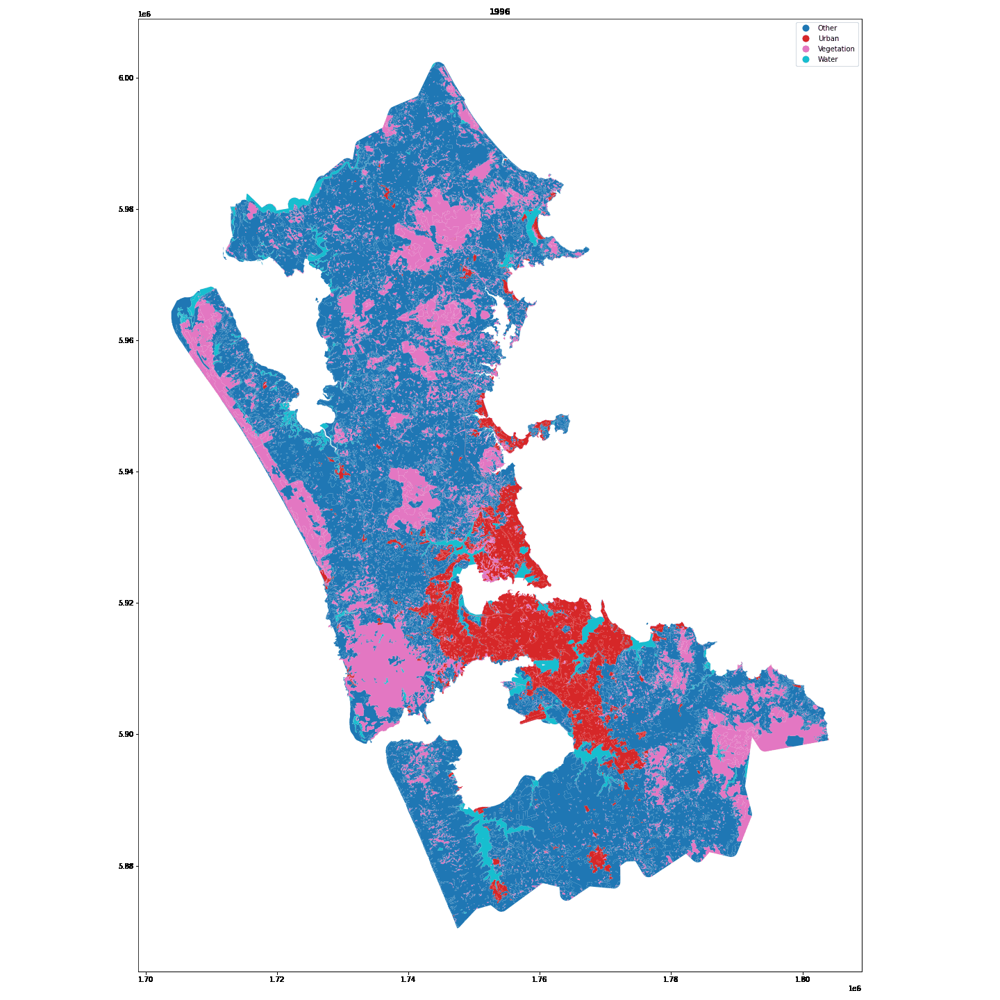
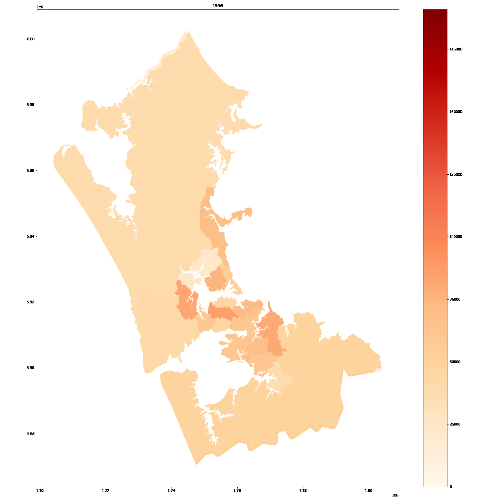

# land_use
Predicting future land use in Auckland using Python


### Installation

Linux/Mac:  
`sudo pip3 install -r requirements.txt`

Windows:

- Install Python 3.9.5 64bit from https://www.python.org/ftp/python/3.9.5/python-3.9.5-amd64.exe, and add it to your PATH
- Install pipwin with the command `pip install pipwin`
- Use pipwin to install the available binary wheels with the command `pipwin install -r requirements.txt`.
- Install the remaining packages with `pip install -r requirements.txt`

### Running

`jupyter-notebook preprocess.ipynb`

### Running with docker

```docker
docker run --rm --volume `pwd`:/app --publish 8888:8888 uoacer/land_use
```

### Notebooks

These Python Jupyter (.ipynb) notebooks have been converted to HTML with `jupyter-nbconvert --to html preprocess.ipynb` for ease of viewing results

- [preprocess](https://uoa-eresearch.github.io/land_use/preprocess)
- [predict](https://uoa-eresearch.github.io/land_use/predict)

### Output GIFs



